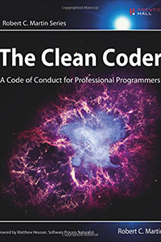

[< Back](../../README.md)

# Clean Coder
**Author:** Robert Cecil Martin  
**Buy:** [Book Depository](https://www.bookdepository.com/Clean-Coder-Robert-C-Martin/9780137081073)

## Quotes

> Why do most developers fear to make continuous changes to their code? They are afraid they'll break it! Why are they afraid? Because they don't have tests.

> Slaves are not allowed to say no. Laborers may be hesitant to say no. But professionals are expected to say no. Indeed, good managers crave someone who has the guts to say no. It's the only way you can really get anything done.

> If you are tired or distracted, do not code.

> The cost of automating acceptance tests is so small in comparison to the cost of executing manual test plans that it makes no economic sense to write scripts for humans to execute.

> Some folks use QA as the bug catchers. They send them code that they haven't thoroughly checked. They depend on the QA to find the bugs and report them back to the developers.

> Your career is your responsibility. It is not your employer's responsibility to make sure you are marketable. It is not your employer's responsibility to train you, or to send you to conferences or to buy you books. These things are your responsibility. Woe to the software developer who entrusts his career to his employer.

> It's a lot easier to be a nonprofessional. Nonprofessionals don't have to take responsibility for the job they do - they leave that to their employers. If a nonprofessional makes an error, the employer cleans up the mess. But when a professional makes a mistake, he cleans up the mess.

> Your code must be readable by other programmers. This is not simply a matter of writing nice comments. Rather, it requires that you craft the code in such a way that it reveals your intent. This is hard to do. Indeed, this may be the most difficult thing a programmer can master.

> Overtime can work, and sometimes it is necessary. Sometimes you can make an otherwise impossible date by putting in some ten-hour days, and a Saturday or two. But this is very risky. You are not likely to get 20% more work done by working 20% more hours What's more, overtime will certainly fail if it goes for more than two or three weeks.

> Professional developers understand that estimates can, and should, be made based on low precision requirements, and recognize that those estimates are estimates. To reinforce this professional developers always include error bars with their estimates so that the business understands the uncertainty.

> You do not have to attend every meeting to which you are invited. Indeed, it is unprofessinal to go to too many meetings. You need to use your time wisely. So be very careful about which meetings you attend and which you politely refuse.

> Perhaps we didn't get into programming to work with people. Though luck for us. Programming is all about working with people. We need to work with our business, and we need to work with each other.