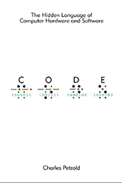

[< Back](../../README.md)

# Code: The Hidden Language of Computer Hardware and Software
**Author:** Charles Petzold  
**Buy:** [Book Depository](https://www.bookdepository.com/Code-Charles-Petzold/9780735611313)

## Takeaway

Although didn't really say anything new compared to what we learnt in the university, this book is an amazing recap on how computers are built up from Logic Gates using combinatory logic.
"You don't use it you lose it" as they say, and unfortunately it is true, at least for me, so reading this book really worth reading it to recap again on the fundamentals of computer internals.

If you are a beginner and you never heard about the internals of a computer before, this book is a must read one.