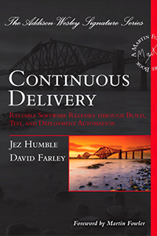

[< Back](../../README.md)

# Continuous Delivery
**Author:** Jez Humble  
**Buy:** [Book Depository](https://www.bookdepository.com/Continuous-Delivery-Jez-Humble/9780321601919)

## Takeaway

**You are doing Continuous Delivery when:**
- Your software is deployable throughout its lifecycle
- Your team prioritizes keeping the software deployable over working on new features
- Anybody can get fast, automated feedback on the production readiness of their systems any time somebody makes a change to them
- You can perform push-button deployments of any version of the software to any environment

**Benefits:**
- Reduced Deployment Risk
- Believable Progress
- User Feedback

## Quotes

> The earlier you catch defects the cheaper they are to fix.

> Asking experts to do boring and repetitive, and yet technically demanding tasks is the most certain way of ensuring human error.
