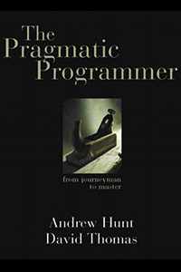

[< Back](../../README.md)

# The Pragmatic Programmer
**Author:** Andrew Hunt  
**Buy:** [Book Depository](https://www.bookdepository.com/Pragmatic-Programmer-Andrew-Hunt/9780201616224)

## Quotes

> You can't write perfect software. Did that hurt? It shouldn't. Accept it as an axiom of life. Embrace it. Celebrate it. Because perfect software doesn't exist. No one in the brief history of computing has ever written a piece of perfect software. It's unlikely that you'll be the first. And unless you accept this as a fact, you'll end up wasting time and energy chasing an impossible dream.

> Tools amplify your talent. The better your tools, and the better you know how to use them, the more productive you can be.

> An investment in knowledge always pays the best interest.

> Great software today is often preferable to perfect software tomorrow.

> All software you write will be tested—if not by you and your team, then by the eventual users—so you might as well plan on testing it thoroughly.

> “If you work closely with your users, sharing their expectations and communicating what you're doing, then there will be few surprises when the project gets delivered. This is a BAD THING. Try to surprise your users. Not scare them, mind you, but DELIGHT them.” 

> Programmers are constantly in maintenance mode.

> Don't leave "broken windows" (bad designs, wrong decisions, or poor code) unrepaired. Fix each one as soon as it is discovered. If there is insufficient time to fix it properly, then board it up. Perhaps you can comment out the offending code, or display a "Not Implemented" message, or substitute dummy data instead. Take some action to prevent further damage and to show that you're on top of the situation.

> Think critically about what you read and hear. You need to ensure that the knowledge in your portfolio is accurate and unswayed by either vendor or media hype.

> Never run on auto-pilot. Constantly be thinking, critiquing your work in real time.